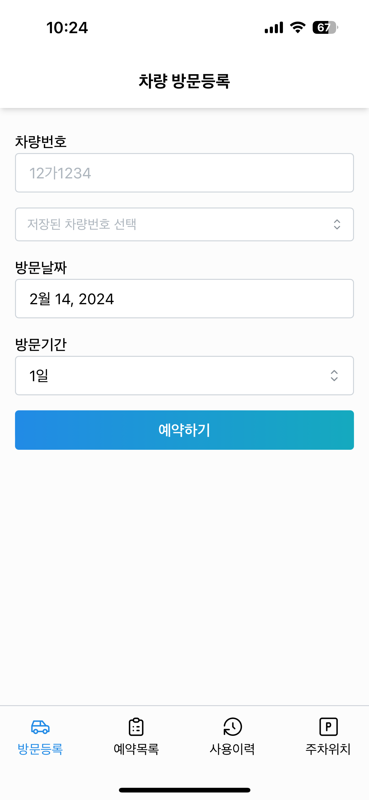
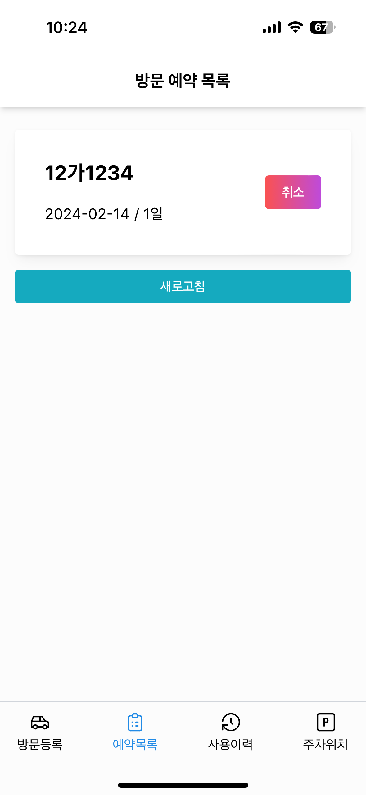
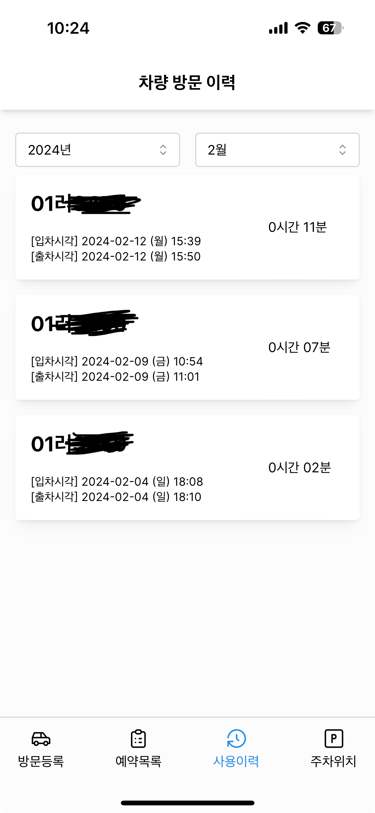
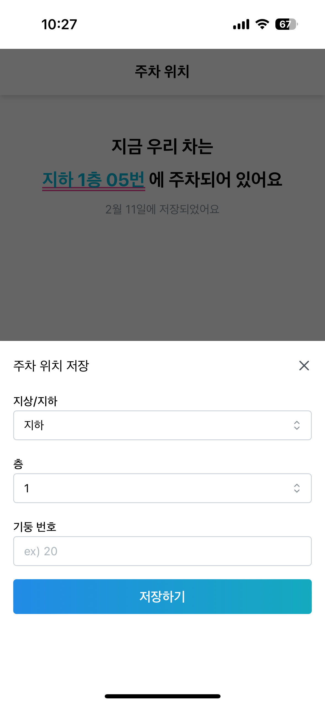

# my-xellop

## About The Project

- 단지 방문자 주차 등록 사이트가 너무 구려서 내가 쓰려고 만든 방문 주차 등록 앱.
- 내 차의 주차 위치를 저장해서 가족 간 공유할 수 있는 기능도 추가함.
- PWA로 스마트폰에서 앱 형태로 사용 가능하게 세팅.

## Screenshot

  
  
  
  
  

## Features

- 방문 주차 등록
- 방문 주차 등록 내역 조회
- 방문 주차 사용 이력 조회
- 내 주차 위치

## Built With

-  : use version 14 and app router
-  : use @vercel/postgres
- [Mantine](https://mantine.dev/) : UI Component library
